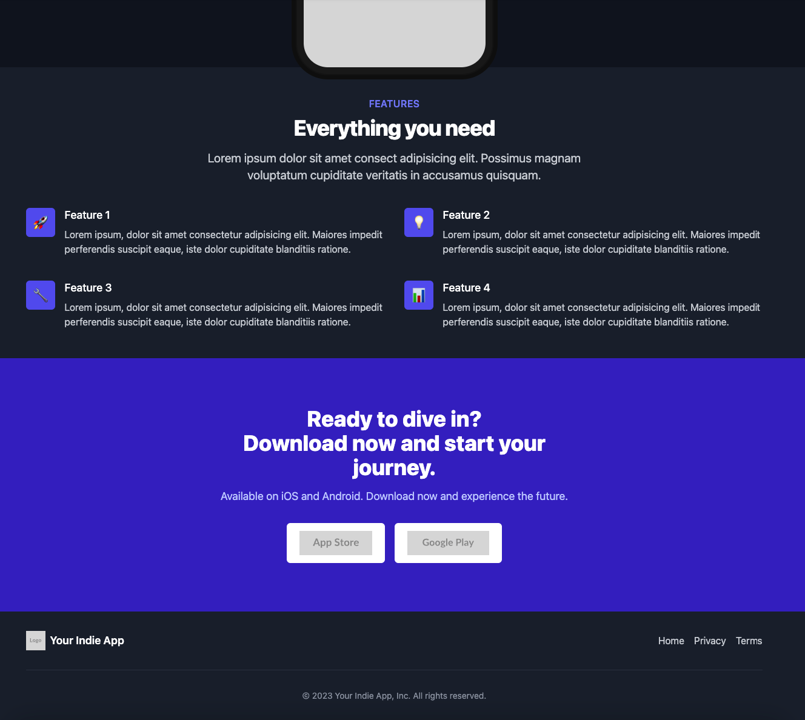

# App Landing Page

A landing page for your indie app, built with Jaspr.

# Mobile

## Features

- Responsive design
- Dark mode support
- Configurable content
- Privacy Policy and Terms of Service pages

## Running the project

Run your project using `jaspr serve`.

The development server will be available on `http://localhost:8080`.

## Building the project

Build your project using `jaspr build`.

The output will be located inside the `build/jaspr/` directory.

## Customization

To customize the content of your landing page, edit the `lib/config/app_config.dart` file. You can modify text, images, and links to match your app's branding and information.

## Contributing

Contributions are welcome! Please feel free to submit a Pull Request.

## License

This project is open source and available under the [MIT License](LICENSE).
